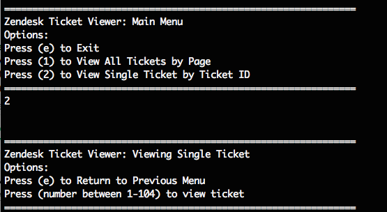

# Zendesk Ticket Viewer

A Ticket Viewing App for Zendesk Tickets

## Getting Started

### Installation

1. Install or update Homebrew.

  ```
  /usr/bin/ruby -e "$(curl -fsSL https://raw.githubusercontent.com/Homebrew/install/master/install)"

  brew update
  ```

  - Optional: install Git if not installed with `brew install git`

2. Install Rbenv and Ruby Build

  ```
  brew install rbenv ruby-build
  ```

3. Install Ruby version 2.4.2

  ```
  rbenv install 2.4.2
  ```

4. Clone Repository & change directory into zendesk_ticket_viewer

  ```
  git clone git@github.com:keitheous/zendesk_ticket_viewer.git

  cd zendesk_ticket_viewer
  ```

5. Bundle install
  ```
  bundle install
  ```

  - You might be required to `gem install bundler` before bundle install


### Rspec, Rubocop & Launching the App

To run the app
```
bundle exec rake
```

To run Rspec
```
bundle exec rspec
```

To run Rubocop
```
rubocop
```

### Interface Instructions

1. Start the application by running `bundle exec rake` in console. Once the tickets have been successfully loaded. The main instructions will appear as below.

    

    

2. Press `1` to view all tickets sectioned by page. In this view mode, you can press any number between 1 - _max_page_ to view page. There are only 25 tickets displayed per page.


3. However, if you had selected `2` to view an individual ticket by ID, the menu would be as below. In this view mode, you can press any number (between 1 - _max_ticket_id_) to view ticket.



4. When you are in both view modes (all and individual), pressing `e` will bring you back to the main menu. On the other hand, pressing `e`  while you are in the main menu will close the application.


5. At any given time, when an invalid response is provided. The message below will appear.


6. The application also takes into consideration what happens when a ticket has been deleted and when there is no internet connection.

    

    


## Objectives & Requirements
Build a Ticket Viewer that will:
1. Connect to the Zendesk API.
2. Request all the tickets for your account.
3. Display them all in a list.
4. Display individual ticket details.
5. Page through tickets when more than 25 are returned.

Non-functional requirements:
1. Include a README with installation and usage instructions.
2. The UI can be browser-based or CLI.
3. The amount of data you display in the ticket list view and the single ticket view is up to you.
4. How you format and display the ticket data is up to you, just ensure it is easy to read.
5. The Ticket Viewer should handle the API being unavailable.
6. We need to see you write ​at least​ a few happy path tests.
7. Submit before due date.

Criteria for Assessment:
1. No extra features are added and all required features have been attempted.
2. Display some knowledge of application design for Separation of concerns & Simplicity.
3. Handle basic errors:
  * Displays a friendly error message if the API is unavailable or the response is
invalid.
  * Tells the user something is wrong if there is a program error.
4. Includes tests.
5. UI is easy to use and displays ticket results clearly.
6. Code demonstrates consistency and adherence to common standards.


## Discussions

I have decided to create a CLI application instead of using a web-based framework (such as Rails or Sinatra) to produce a solution that is simple and lightweight. I am aware that the solution could have been written in one procedural script, however I wanted to take the opportunity to showcase some of the object oriented design skills I obtained in the past few months and just focus on Ruby and Rspec.

Rspec tests are written cover some core functionalities and Rubocop is used to enforce style consistency. I have also decided to use HTTParty Gem to make API calls instead of Ruby's built-in Net::HTTP class as it is much neater and cleaner to use.


### Classes & Responsibilities

Classes were built separately, each with its own responsibility, to address Separation of Concerns in this application.

No| Class               | Responsibility                                  
--|:-------------------:|:-------------------------------------------------:
1 | Ticket              | Represent a single ticket object                         
2 | TicketMaster        | Collects Tickets from API                          
3 | ZendeskApi          | Make ZendeskAPI HTTP Request (with Authentication)
4 | ApiServiceController| Executes the number of requests required to collect all tickets
5 | Cli                 | Provide user with CLI instructions for View Modes
6 | TicketViewer        | Print table for View All Tickets Mode, sectioned by page


### Object Oriented Design Decisions

Diving into this coding challenge, I was aware of the importance of Object Oriented Design mainly because Ruby is an object oriented language and having good design means writing code that embraces the inevitable - change. Design makes code easier and cheaper to change, but also flexible, modular, reusable and understandable. Although I try to design my classes to be S.O.L.I.D, D.R.Y, loosely-coupled and highly cohesive, there were a few exceptions.

These exceptions exist due to the the scale and simplicity of this coding challenge. The questions that I ask myself are,
> Is this implementation necessary?

> Am I now adding an unnecessary layer of complexity?

> How can this code be reused or changed in the future? ~~I wish I was psychic.~~

There is also a fear of over-designing. Here's what Sandi Metz has to say about programmers who over-design.

> In an excess of enthusiasm, (we) apply principles inappropriately and see patterns where none exist. (we) construct complicated, beautiful castles of code and then are distressed to find (our)selves hemmed in by stone walls.

Therefore, I try (to my best conscience) to not do that.

Going along with the Single Responsibility Principle (SRP), the classes are built to just do its own thing, focus on that and do it well. I just need to be aware of the messages that are passed between these classes. I also use Dependency Injection and Composition to manage these interactions.

#### How the Classes interact as a Unit


### API Requests & Processing Tickets

One of the most interesting part when building this application was making the API Service Controller decide on the number of API calls that are required and execute them to collect all the tickets.

Studying the structure of Zendesk API responses for Tickets, it is a Hash with four key-value pairs. The keys are,

1. `response["tickets"]` which contains a maximum of 100 tickets,

2. `response["next_page"]` which holds the url to the next page of tickets (next 100 tickets),

3. `response["previous_page"]` which holds the url to the previous page of tickets (previous 100 tickets), and

4. `response["count"]` which is an overall count of all tickets

To elaborate further,
1. In a scenario where there are 58 tickets **(condition: less or exactly 100 tickets)**, Only 1 API request is required because all 58 tickets can be found in the response (`response["tickets"]`). `response["next_page"]` and `response["previous_page"]` is _nil_.

2. In a scenario where there are 102 tickets **(condition: more than 100 tickets)**, 2 API requests are required because the first 100 tickets are contained within `response["tickets"]` of the first response. The last 2 tickets is within the `response["tickets"]` of `response["next_page"]`.

3. 201 tickets would require 3 calls.
  + Ticket 1-100 would be in the first call,
  + 101 - 200 in the second, and
  + 201 in the third.

#### Solution 1: Relying on 'next_page'

A way automatically trigger API calls to retrieve all tickets would be to rely on the next_page key of the responses, as suggested by the [docs](https://develop.zendesk.com/hc/en-us/articles/360001068607#add).

Unless `response["next_page"]` is _nil_, keep requesting for `response["next_page"]` url. We then collect the tickets from each of these responses.

While this was a possible solution, it was not the best as we would only have a tunnelled vision of what is ahead (next page).

#### Solution 2: using 'count' to determine total pages

`response["count"]` provides an overhead information of all tickets. We know that there can only be a maximum _100 tickets per page_. This was a crucial information that we can use to our advantage.

Say if we have _201 tickets_, how many calls do we need to make to cover all 201 tickets?

Dividing 201 tickets with 100 would return 2.01. Using a `.ceil` method on this would round *up* this figure, resulting in the number of total pages and necessary API calls.

```
Scenario 1: 201 Tickets to retrieve
201 tickets / 100.00 max tickets = 2.01
(2.01).ceil = 3 = 3 pages = 3 API calls (total)


Scenario 2: 58 Tickets to retrieve
58 tickets / 100.00 max tickets = 0.58
(0.58).ceil = 1 = 1 page = 1 API call


Formula = (max_ticket_count / max_ticket_per_page).ceil

f(x) = (x / 100).ceil

```

#### Calling API & Optimizing the call

A decision on when to make the calls for tickets page can determine the speed of the User Interface.

> Option A : Do we make an API request for next page whenever the user clicks on next page?

*OR*

> Option B : Do we request for all the tickets once in the beginning, cache the data, then render the pages according to what the user wants?

Option B of course!

To do this, it was important to assume that these tickets are somewhat static and no additional tickets are to be added into the collection WHILE a user is viewing. This was a safe assumption that I was able to clear with Ryan through Slack, Thanks Ryan!! =)

Another challenging task was to optimize the API calls. I have identified that tickets count `res['count']` is the key to solving this challenge (Solution 2: using count for overhead view). I had an idea that if I could grab hold of this value first, my code would not be so repetitive. DRY.

For days I kept asking myself

> Which one comes first? The chicken or the egg?

Egg first:
+ Should I grab the *count* first via an initial API call then collect the tickets by page?

+ CON: **a waste of initial api call, might as well collect the tickets of page one**

+ STEPS: API CALL > COUNT > START LOOP > API CALL PAGE 1 > COLLECT TICKETS PAGE 1 > API CALL PAGE 2 > COLLECT TICK...

Chicken first:

* Should I do an initial API call, collect the tickets of page one, grab the *count*, then collect tickets of other pages?

* CON: **there is api call AND tickets collection - before AND after identifying count**.

* STEPS: API CALL > COLLECT TICKETS PAGE 1 > COUNT > START LOOP > API CALL PAGE 2 > COLLECT TICKETS PAGE 2 > API CALL PAGE 3 > COLLECT TICK...

Pseudocode

Egg                                    | Chicken
---------------------------------------|:-------
Initial API Call                       | Initial Api Call
Get the Count                          | Collect Tickets Page
Determine the pages from Count         | Get the Count
Loop Pages, Additional API Call by loop, Collect tickets by loop  | Determine the pages from Count
... |  Loop Pages, Additional API Call by loop, Collect tickets by loop


Between Chicken and Egg, Identifying 'count' occurs much later in Chicken. Egg seems a whole lot DRYer than Chicken.

Then it occurred to me. I have been thinking in and about loops, but I have failed to consider what if there is only 1 page? ~~Revelation!~~

Going with Egg first, is it worth it to make an API call for page one just to obtain Count? then make the same API call to collect the tickets? No.

With no additional pages -> total API count for Egg is 2

Going with Chicken first, it is worth it to make one API call, collect the tickets and identify count? Maybe.
With no additional pages -> total API count for Chicken is 1 Yasss! Fabulous!

I chose chicken.


## Future Improvements
+ Use VCR gem to record and replay test suite's HTTP interactions
+ Use better method and class names
+ Train the brain to think object oriented
+ Write better tests and exception handling


---
###### Thank you for the coding challenge, I truely enjoyed it =)
